# MediKiosk — Intelligent OPD Case-Taking & Triage Assistant

[](#)
[](#)
[](#)
[](#)
[](#)
[](#)

---

## 1. Project Overview

**MediKiosk** is a touch-first, multilingual, multimodal healthcare kiosk system designed for hospital Outpatient Departments (OPDs). It streamlines patient intake by registering patient demographics, obtaining traceable informed consent, conducting adaptive clinical interviews in English and Hindi with voice interactions, extracting clinical entities from paper records via OCR, flagging urgent red flags for triage nurses, generating comprehensive non-diagnostic clinical summaries with chronological timelines, capturing classical AYUSH clinical parameters (Dashavidha Pariksha), and providing an auditable physician dashboard where doctors review, edit, and formally confirm patient clinical dossiers.

---

## 2. Problem Statement & Clinical Objective

Overburdened OPDs in secondary and tertiary hospitals in India face severe challenges:
- **Severe Time Pressure**: Doctors often have less than 3 to 5 minutes per patient consultation.
- **Repetitive Case-Taking**: Gathering demographic, chronic illness, surgical, allergy, and medication histories consumes valuable physician time.
- **Language & Literacy Barriers**: Elderly and rural patients frequently struggle with text-heavy interfaces or unfamiliar medical terminology.
- **Paper Fragmentations**: Patients present faded prescriptions, disparate lab reports, and handwritten notes that are difficult to synthesize rapidly.
- **Clinical Safety Risks**: Urgent red-flag symptoms (such as acute coronary syndromes, severe asthma exacerbations, or neuro deficits) can sit undetected in general queues.

**MediKiosk addresses these challenges by:**
1. Shifting preliminary intake, consent, and document digitisation to interactive waiting-room kiosks.
2. Offering voice interactions and touch chip options in Hindi and English.
3. Automatically flagging red flags to alert triage staff immediately.
4. Synthesizing authentic patient statements and OCR extractions into a doctor-ready dossier.
5. Strictly preserving the physician as the sole diagnostic decision-maker.

---

## 3. Key Features by Phase

- **Phases 1–3: Patient Registration & OPD Token Generation**:
  - Validates full name, age, gender, phone number, address, and primary complaint.
  - Generates sequential daily OPD tokens (`MK-YYYYMMDD-XXXX`) stored in MongoDB.
- **Phase 4: Bilingual Informed Consent & Language Selection**:
  - Transparent consent disclosure in English and Hindi.
  - Traceable lifecycle: grant, pre-flight gate check, and revocation with documented clinical reasons.
- **Phase 5: Adaptive Clinical Intake Engine**:
  - Rule-based and heuristic dynamic branching across Chief Complaints, HPI, Past History, Medications, and Allergies.
  - Non-diagnostic guardrails with touch-friendly quick chips.
- **Phase 6: Multimodal Voice Interface**:
  - Bilingual voice output (TTS) and voice recognition (STT) for Indian English and Hindi (`hi-IN`).
  - Native audio streaming and fallback for elderly and low-literacy users.
- **Phase 7: Real-Time Red-Flag Detection & Emergency Triage**:
  - Scans intake answers against high-risk clinical rule sets (cardiovascular, respiratory, neurological, obstetric, trauma).
  - Generates triage alerts (`URGENT`, `HIGH`) and notifies hospital staff.
- **Phase 8: Document Upload, OCR & Medical Entity Extraction**:
  - Secure upload for prescriptions, lab investigations, and discharge summaries (PDF, PNG, JPG).
  - Tesseract OCR engine with multilingual support (`eng+hin`).
  - Extracts structured medications, dosages, lab values, and flags low-confidence handwriting for review.
- **Phase 9: Chronological Medical Timeline & AI Clinical Summary**:
  - Merges interview dates and document records into a unified chronological timeline.
  - Separates undated events to prevent clinical hallucination.
  - Synthesizes a 14-section AI draft summary with prominent non-diagnostic disclaimers.
- **Phase 10: Doctor Dashboard & Physician Review**:
  - Real-time OPD queue with search, triage filters, and review status tracking.
  - Full 8-section clinical dossier review.
  - In-place summary drafting with version history snapshots and formal physician confirmation sign-off.
- **Phase 11: AYUSH Clinical History Mode & Authentication/RBAC**:
  - Classical Ayurvedic history intake (Agni, Koshta, Bala, Satmya, Ahara, Vihara, Nidra, Mala, Mutra, Manasika).
  - Dashavidha Pariksha 10-fold examination matrix.
  - Multi-role RBAC (`patient`, `doctor`, `triage_staff`) with salted bcrypt password hashing and PyJWT tokens.
  - Strict IDOR defense preventing cross-patient data access.
- **Phase 12: Privacy, Audit Ledger & Interoperability Architecture**:
  - Append-only clinical and security audit ledger with automated credential redaction.
  - Ayushman Bharat Digital Mission (ABDM) / ABHA linking adapter (14-digit validation and privacy masking).
  - HL7 FHIR R4 Bundle export (`collection` bundle containing `Patient`, `Encounter`, `Observation`, `Composition`).
  - Hospital Information System (HIS) / EMR gateway architecture.
  - Truthful status reporting (`AVAILABLE`, `LOCAL_ONLY`, `NOT_CONFIGURED`).
- **Phase 13: UI/Accessibility Polish & Deployment Preparation**:
  - High-contrast kiosk touchscreen cards for elderly and low-literacy users.
  - Production environment configuration templates.
  - Comprehensive automated test suite and live E2E verification with zero-mock-data cleanup.

---

## 4. Architecture & Data Flow

```mermaid
flowchart TD
    subgraph Kiosk ["Patient Kiosk / Web Interface (Next.js 14)"]
        UI_HOME["/ — Kiosk Touch Navigation"]
        UI_REG["/register — Demographic Intake & OPD Token"]
        UI_CON["/consent — Bilingual Consent & Revocation"]
        UI_INT["/interview — Adaptive Clinical Intake (General & AYUSH)"]
        UI_DOCS["/documents — Prescription/Report Upload & OCR"]
        UI_QUEUE["/queue — Live OPD Queue Status"]
    end

    subgraph Staff ["Staff & Doctor Portals"]
        UI_DOC["/doctor — Patient Queue & 9-Section Clinical Dossier"]
        UI_TRIAGE["/triage — Emergency Red-Flag Alert Monitoring"]
    end

    subgraph Backend ["FastAPI Application Server"]
        AUTH_ROUTER["/api/auth — Registration, Login, Token Management"]
        PAT_ROUTER["/api/patients — Intake, Consent, Documents, Timeline"]
        INT_ROUTER["/api/interview — Adaptive Q&A & Mode Dispatcher"]
        VOICE_ROUTER["/api/voice — Speech Synthesis & Transcription"]
        TRI_ROUTER["/api/triage — Emergency Rule Engine"]
        DOC_ROUTER["/api/doctor — Clinical Dossier, Editing & Confirmation"]
        AUDIT_ROUTER["/api/audit — Tamper-Resistant Security Audit Ledger"]
        INTG_ROUTER["/api/integrations — ABDM, FHIR R4, HIS/EMR Gateways"]
    end

    subgraph Storage ["MongoDB Persistence Layer"]
        COL_USERS["users (Bcrypt Hashes, Roles)"]
        COL_PAT["patients (Profiles, OPD Tokens, Summary, Timeline)"]
        COL_CONSENT["consent_records (Versioned Consent History)"]
        COL_SESS["interview_sessions (Verbatim Q&A)"]
        COL_DOCS["medical_documents (Files, OCR Entities)"]
        COL_TRIAGE["triage_alerts (Urgent Red Flags)"]
        COL_AUDIT["audit_logs (Immutable Audit Entries)"]
    end

    UI_REG --> PAT_ROUTER
    UI_CON --> PAT_ROUTER
    UI_INT --> INT_ROUTER
    UI_INT --> VOICE_ROUTER
    UI_DOCS --> PAT_ROUTER
    UI_QUEUE --> PAT_ROUTER
    UI_DOC --> DOC_ROUTER
    UI_TRIAGE --> TRI_ROUTER

    PAT_ROUTER --> COL_PAT
    PAT_ROUTER --> COL_CONSENT
    PAT_ROUTER --> COL_DOCS
    INT_ROUTER --> COL_SESS
    INT_ROUTER --> COL_TRIAGE
    AUTH_ROUTER --> COL_USERS
    DOC_ROUTER --> COL_PAT
    AUDIT_ROUTER --> COL_AUDIT
```



---

## 5. Technology Stack

### Backend
- **Framework**: FastAPI (Python 3.10+)
- **Database Driver**: Motor / PyMongo (Async MongoDB Driver)
- **Security & Cryptography**: `passlib[bcrypt]` (12-round salted hashing), `PyJWT` (HS256 tokens)
- **OCR Engine**: Tesseract OCR via `pytesseract` and Pillow (`PIL`)
- **Voice / Speech**: `gTTS` (Google Text-to-Speech) & Web Speech API
- **Testing**: `pytest`, `pytest-asyncio`, `httpx`

### Frontend
- **Framework**: Next.js 14 (App Router)
- **Language**: TypeScript
- **Styling**: Tailwind CSS, Lucide React Icons
- **Audio Recording**: Web Audio API / MediaRecorder API

### Database & Storage
- **Database**: MongoDB 7.0+
- **File Storage**: Local filesystem with patient-isolated directory isolation and SHA-256 duplicate checking

---

## 6. Project Structure

```
MediKiosk/
├── .env.example                     # Root unified environment variables template
├── .gitignore                       # Strict Git ignore (PHI, uploads, secrets, keys)
├── README.md                        # Comprehensive system documentation
├── backend/
│   ├── .env.example                 # Backend configuration template
│   ├── requirements.txt             # Python dependencies
│   ├── app/
│   │   ├── config.py                # Pydantic BaseSettings environment loader
│   │   ├── database.py              # MongoDB connection & collection accessors
│   │   ├── main.py                  # FastAPI app entry point & router mounting
│   │   ├── models/                  # Pydantic data schemas
│   │   │   ├── audit.py             # Audit log models & event types
│   │   │   ├── auth.py              # User roles, registration & JWT models
│   │   │   ├── ayush.py             # AYUSH clinical parameters & Dashavidha
│   │   │   ├── consent.py           # Consent lifecycle & revocation models
│   │   │   ├── doctor.py            # Doctor queue, dossier, versioning models
│   │   │   ├── document.py          # Document upload & OCR metadata models
│   │   │   ├── integration.py       # System integration status schemas
│   │   │   ├── interview.py         # Clinical Q&A & session models
│   │   │   ├── patient.py           # Patient demographics & OPD registration
│   │   │   ├── summary.py           # 14-section AI summary & timeline schemas
│   │   │   └── triage.py            # Red-flag alerts & triage priority schemas
│   │   ├── routes/                  # API endpoint routers
│   │   │   ├── audit.py             # Audit inspection routes (doctor & self)
│   │   │   ├── auth.py              # Auth registration, login & token verification
│   │   │   ├── doctor.py            # Doctor queue, dossier, editing & confirmation
│   │   │   ├── document.py          # Document upload, process, view & delete
│   │   │   ├── integrations.py      # ABDM, FHIR R4, HIS/EMR status & export
│   │   │   ├── interview.py         # Adaptive clinical interview routes
│   │   │   ├── patient.py           # Patient registration & consent routes
│   │   │   ├── summary.py           # Medical timeline & AI summary routes
│   │   │   ├── triage.py            # Red-flag detection & triage alert routes
│   │   │   └── voice.py             # Speech synthesis & transcription routes
│   │   ├── services/                # Business logic & external adapters
│   │   │   ├── abdm_service.py      # ABDM/ABHA linking & 14-digit validation
│   │   │   ├── ai_service.py        # Adaptive questioning engine & AI router
│   │   │   ├── audit_service.py     # Append-only audit logger & secret redaction
│   │   │   ├── auth_service.py      # Bcrypt hashing & PyJWT token generator
│   │   │   ├── ayush_service.py     # AYUSH questioning & Dashavidha parser
│   │   │   ├── clinical_summary_service.py # 14-section clinical summary synthesizer
│   │   │   ├── consent_service.py   # Consent tracking, revocation & pre-flight gate
│   │   │   ├── doctor_service.py    # Doctor queue & 8-section dossier aggregator
│   │   │   ├── document_storage.py  # File validation, SHA-256 & disk storage
│   │   │   ├── fhir_service.py      # HL7 FHIR R4 Bundle synthesizer
│   │   │   ├── his_emr_service.py   # Hospital HIS/EMR gateway adapter
│   │   │   ├── medical_extraction_service.py # Clinical entity extractor
│   │   │   ├── medical_timeline_service.py   # Chronological timeline synthesizer
│   │   │   ├── ocr_service.py       # Tesseract OCR wrapper
│   │   │   └── triage_detector.py   # Red-flag rule engine
│   │   └── utils/
│   │       └── auth_deps.py         # FastAPI security dependencies (RBAC & IDOR)
│   └── tests/                       # 17 automated test modules (93 tests)
├── frontend/
│   ├── .env.example                 # Frontend configuration template
│   ├── package.json                 # Node dependencies
│   ├── tsconfig.json                # TypeScript configuration
│   ├── tailwind.config.ts           # Tailwind styling configuration
│   ├── app/                         # Next.js 14 App Router pages
│   │   ├── components/Header.tsx    # Navigation header with role badges & logout
│   │   ├── consent/page.tsx         # Informed consent & revocation UI
│   │   ├── doctor/page.tsx          # Doctor queue & interoperability status bar
│   │   ├── doctor/patient/[patientId]/page.tsx # Physician dossier, edit & sign-off
│   │   ├── documents/page.tsx       # Document upload, preview & OCR viewer
│   │   ├── interview/page.tsx       # Clinical interview (touch chips, voice, AYUSH)
│   │   ├── login/page.tsx           # Multi-role login & registration portal
│   │   ├── page.tsx                 # High-contrast kiosk home touch cards
│   │   ├── queue/page.tsx           # Live OPD token queue monitor
│   │   ├── register/page.tsx        # Patient registration form
│   │   ├── summary/page.tsx         # Patient summary & timeline view
│   │   └── triage/page.tsx          # Staff triage alert dashboard
│   └── lib/
│       ├── audioRecorder.ts         # Browser audio recorder for voice STT
│       ├── auth.ts                  # Client authentication helpers & tokens
│       └── config.ts                # Centralized API base URL config
└── scratch/                         # Verification test scripts
```

---

## 7. Setup & Prerequisites

### Prerequisites
1. **Python 3.10+**: Ensure Python is installed and in `PATH`.
2. **Node.js 18+ / 20+**: Ensure Node.js and `npm` are installed.
3. **MongoDB**: Local MongoDB instance or MongoDB Atlas connection URI.
4. **Tesseract-OCR** (Optional, for image OCR):
   - Windows: Install Tesseract-OCR into `C:\Program Files\Tesseract-OCR`.
   - Linux: `sudo apt-get install tesseract-ocr tesseract-ocr-hin`

---

## 8. Environment Variables Reference

Copy `.env.example` to `backend/.env`:

```bash
# Core Infrastructure
MONGODB_URI=mongodb://127.0.0.1:27017
DATABASE_NAME=medikiosk
BACKEND_HOST=127.0.0.1
BACKEND_PORT=8000
ENVIRONMENT=development
CORS_ORIGINS=["http://localhost:3000","http://127.0.0.1:3000"]

# Authentication & Session Security (JWT)
JWT_SECRET_KEY=generate_a_cryptographically_secure_random_key_for_production
JWT_ALGORITHM=HS256
ACCESS_TOKEN_EXPIRE_MINUTES=1440

# AI Configuration (Optional: uses heuristic engine when unset)
AI_API_KEY=
AI_MODEL=gemini-1.5-flash
AI_PROVIDER=heuristic
AI_TIMEOUT_SECONDS=8.0
MAX_ADAPTIVE_QUESTIONS=15

# OCR Configuration
TESSERACT_CMD=C:\Program Files\Tesseract-OCR\tesseract.exe
TESSDATA_PREFIX=C:\Program Files\Tesseract-OCR\tessdata
OCR_DEFAULT_LANGUAGES=eng+hin

# ABDM / ABHA (Optional: reports NOT_CONFIGURED when unconfigured)
ABDM_CLIENT_ID=
ABDM_CLIENT_SECRET=
ABDM_BASE_URL=
ABDM_BRIDGE_URL=

# HL7 FHIR (Optional: exports local bundles when unconfigured)
FHIR_SERVER_URL=
FHIR_API_KEY=
FHIR_VERSION=R4

# Hospital HIS / EMR (Optional: reports NOT_CONFIGURED when unconfigured)
HIS_EMR_BASE_URL=
HIS_EMR_API_KEY=
HIS_EMR_HOSPITAL_ID=
```

Frontend environment configuration (`frontend/.env.local`):

```bash
NEXT_PUBLIC_API_URL=http://127.0.0.1:8000
```

---

## 9. Running the Application Locally

### Starting Backend (FastAPI)

```bash
# 1. Navigate to repository root
cd MediKiosk

# 2. Activate virtual environment or set PYTHONPATH
$env:PYTHONPATH="backend"   # Windows PowerShell
# export PYTHONPATH=backend  # Linux / macOS

# 3. Start FastAPI server
python -m uvicorn app.main:app --host 127.0.0.1 --port 8000 --reload
```
The backend API documentation is available at `http://127.0.0.1:8000/docs`.

### Starting Frontend (Next.js)

```bash
# 1. Navigate to frontend directory
cd frontend

# 2. Install dependencies
npm install

# 3. Start development server
npm run dev
# Or build and run production server:
npm run build
npm start
```
The kiosk interface is available at `http://localhost:3000`.

---

## 10. Automated & Live Verification Testing

### 1. Pytest Automated Test Suite
Run the full 93-test regression suite across all 17 test modules:

```bash
$env:PYTHONPATH="backend"
pytest backend/tests -v
```

### 2. Live Comprehensive E2E Verification Script
Run the automated end-to-end audit script that verifies all 23 clinical, security, and interoperability capabilities against running backend and frontend instances:

```bash
python scratch/verify_phase13_final.py
```
> [!NOTE]
> `verify_phase13_final.py` automatically performs post-test cleanup of all temporary test patients, users, sessions, and documents from MongoDB and disk storage, ensuring zero lingering test data.

---

## 11. Security, Privacy & Zero-Mock-Data Guardrails

1. **Zero Mock Data Policy**:
   - Every patient record, clinical history answer, and document entry originates from genuine user input and live MongoDB collections.
   - Zero hardcoded mock databases or dummy patients in production code.
2. **Strict Cryptographic Protection**:
   - User passwords are encrypted with `bcrypt` (12 rounds of salted hashing). Plaintext passwords are never stored.
   - Session authentication uses signed `PyJWT` tokens (HS256).
3. **IDOR & RBAC Protection**:
   - `verify_patient_ownership` ensures patients cannot access or tamper with other patients' medical records (`HTTP 403 Forbidden`).
   - `require_role` enforces role isolation (`patient`, `doctor`, `triage_staff`).
4. **Append-Only Redacted Audit Ledger**:
   - All mutations, clinical accesses, IDOR violations, and authentication events are logged to the immutable `audit_logs` collection.
   - Automatic credential sanitization replaces passwords, API keys, secrets, and auth tokens with `[REDACTED]`.
5. **Traceable Consent Revocation**:
   - Patient consent changes require documented reasons and are logged in versioned history records.
   - Revoked consent halts clinical intake immediately.

---

## 12. Healthcare Interoperability Status (Truthful Reporting)

MediKiosk implements modular interoperability adapters that report truthful status without mock connectivity claims:

- **MongoDB Database**: `AVAILABLE` — Fully operational local database with compound indexes.
- **Authentication & RBAC**: `AVAILABLE` — Bcrypt hashing, JWT tokens, role enforcement.
- **Ayushman Bharat Digital Mission (ABDM / ABHA)**: `NOT_CONFIGURED` — Supports 14-digit format validation (`XX-XXXX-XXXX-XXXX`), privacy masking (`XXXXXXXXXXXX`), and linking. Reports unconfigured status until national sandbox keys are provided.
- **HL7 FHIR R4 Bundle Engine**: `LOCAL_ONLY` — Synthesizes fully compliant HL7 FHIR R4 `Bundle` (type: `collection`) with `Patient`, `Encounter`, `Observation`, and `Composition` resources from live MongoDB data.
- **Hospital HIS / EMR Gateway**: `NOT_CONFIGURED` — Standardized integration interface reporting truthful unconfigured status until hospital endpoint parameters are configured.

---

## 13. Known Limitations & Future Roadmap

### Known Limitations
- **External Network Gateways**: Live ABDM M1/M2/M3 transactions and remote hospital EMR sync require active hospital gateway credentials and firewall whitelisting.
- **Offline Mode**: Operates within a hospital local area network (LAN); full offline sync requires local SQLite edge replication.

### Future Roadmap
- Integration with ABDM unified health interface (UHI) for direct appointment token syncing.
- Offline-first Progressive Web App (PWA) caching for rural community health clinics.
- Multi-dialect regional speech recognition expansion (Tamil, Telugu, Bengali, Marathi).

---

## 14. License

MediKiosk is open-source software licensed under the Apache License 2.0.
